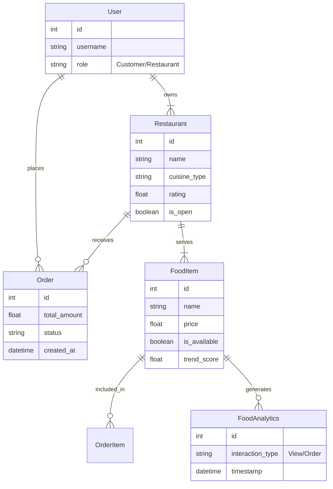

# 🍽️ Deliciae - Smart Dining Platform

**Deliciae** is a premium AI-powered web application that provides real-time food availability updates, automatic trend detection, and a seamless connection between customers and restaurants.


## 🚀 Key Features

### For Customers
- **Live Availability:** See exactly what's available in the kitchen right now.
- **Smart Trends:** Discover "Trending Now" dishes based on real user interactions.
- **Premium UI:** A glassmorphism-inspired design with smooth animations.

### For Restaurants
- **Instant Control:** One-tap toggle to mark items as "Sold Out" or "Available".
- **Real-time Dashboard:** Track orders and view active menu status.
- **Menu Management:** Easily add or edit dishes.

---

## 🛠️ Installation & Setup

1.  **Clone the repository:**
    ```bash
    git clone https://github.com/yourusername/deliciae.git
    cd deliciae
    ```

2.  **Setup Backend (Django):**
    ```bash
    cd backend
    python -m venv venv
    ./venv/Scripts/Activate  # or source venv/bin/activate on Mac/Linux
    pip install django djangorestframework
    python manage.py migrate
    python populate_db.py  # (Optional) Load sample data
    python manage.py runserver
    ```

3.  **Run Application:**
    - The application (Frontend + Backend) is served by Django.
    - Open **[http://127.0.0.1:8000/](http://127.0.0.1:8000/)** in your browser.
    - **Do not** open HTML files directly or use a separate live server for pages with `` tags.

4.  **Login Credentials:**
    - **Restaurant:** `pizza_paradise@example.com` / `res123`
    - **Admin:** `admin@example.com` / `admin123`

---

## 📊 System Design (ER Diagram)

Below is the Entity-Relationship structure of the Deliciae backend:



## 🏗️ Project Structure

```
deliciae/
├── backend/            # Django Project
│   ├── core/           # Main App (Models, Views, APIs)
│   ├── deliciae_core/  # Settings & Config
│   └── manage.py
├── frontend/           # UI Files
│   ├── css/            # Styles (Glassmorphism)
│   ├── js/             # Logic (Dashboard, Interactions)
│   └── *.html          # Pages
└── report.tex          # Project Report (LaTeX)
```

---
*Created for Final Year Project 2025*
